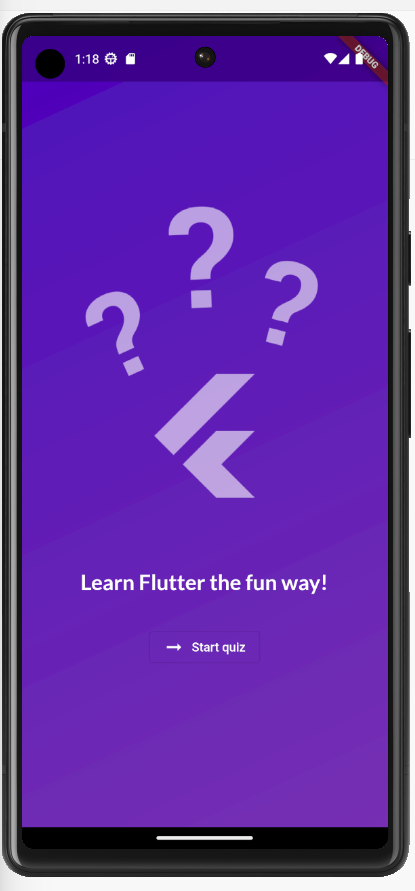

<h1 align="center">Quiz App</h1>

Nesse projeto eu desenvolvi um aplicativo de perguntas e respostas durante meus estudos sobre desenvolvimento Mobile com Flutter & Dart.

## 🚀 Começando

O intuito desse projeto foi focado nos estudos e na compreensão dos fundamentos intermediários do Flutter:

<ul>
  <li>Para o que serve a key</li>
  <li>Renderizando conteúdos condicionais</li>
  <li>Função initState()</li>
  <li>Criando um Model no Flutter</li>
  <li>Usando funções map(), where(), shuffle()</li>
  <li>Utilizando fontes externas</li>
  <li>Usando "for" em listas</li>
  <li>Comunicação entre Widgets</li>
  <li>Widgets Expanded e SingleChildScrollView</li>
</ul>

 

## 🛠️ Construído com

* [Flutter](https://flutter.dev/) - Framework
* [Dart](https://dart.dev) - Linguagem de programação
* [Android Studio](https://developer.android.com/studio?gclid=CjwKCAjwuqiiBhBtEiwATgvixBAirq1H4W0KCvEgujtfr2vMhfs42lGVPIFs2PhnON0ELj5sNhO1LhoCCO8QAvD_BwE&gclsrc=aw.ds) - Ambiente de desenvolvimento e Emulador
* [Google Fonts](https://fonts.google.com) - Fontes de texto gratuitas usadas no projeto
